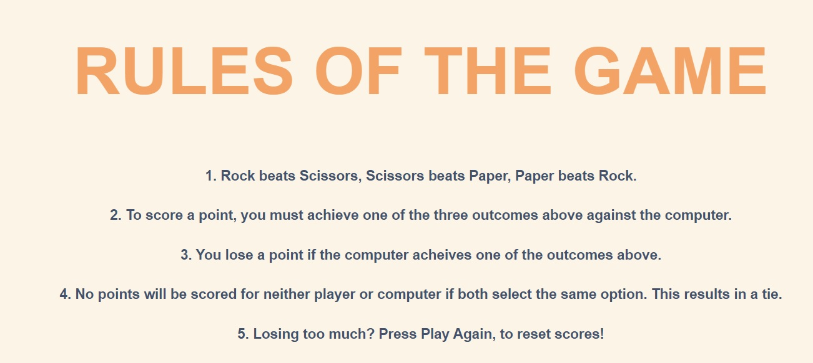
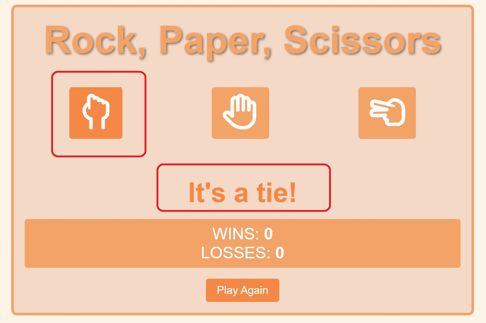
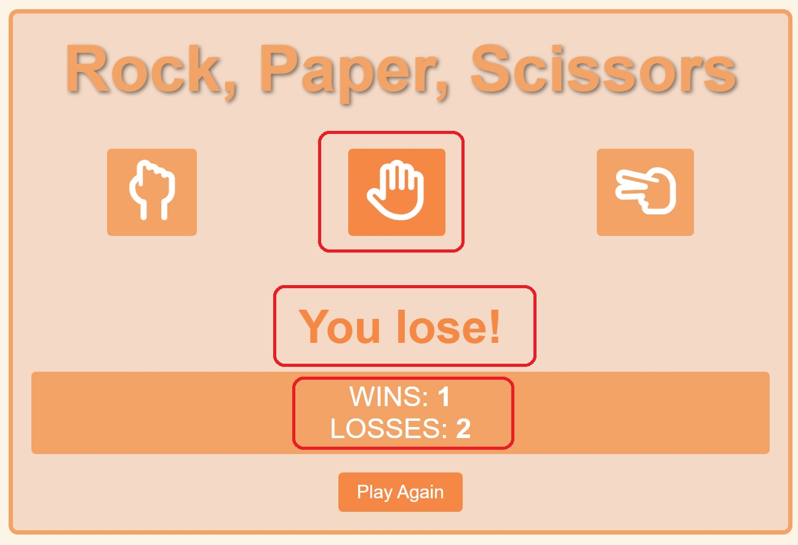
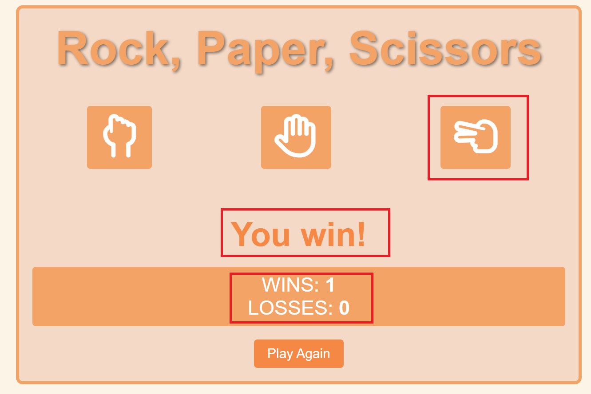
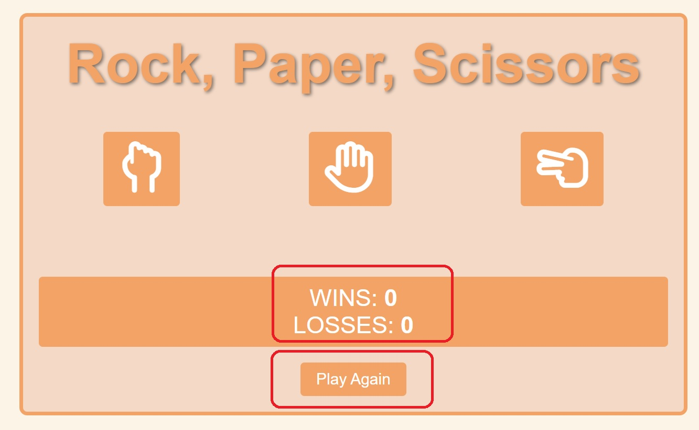
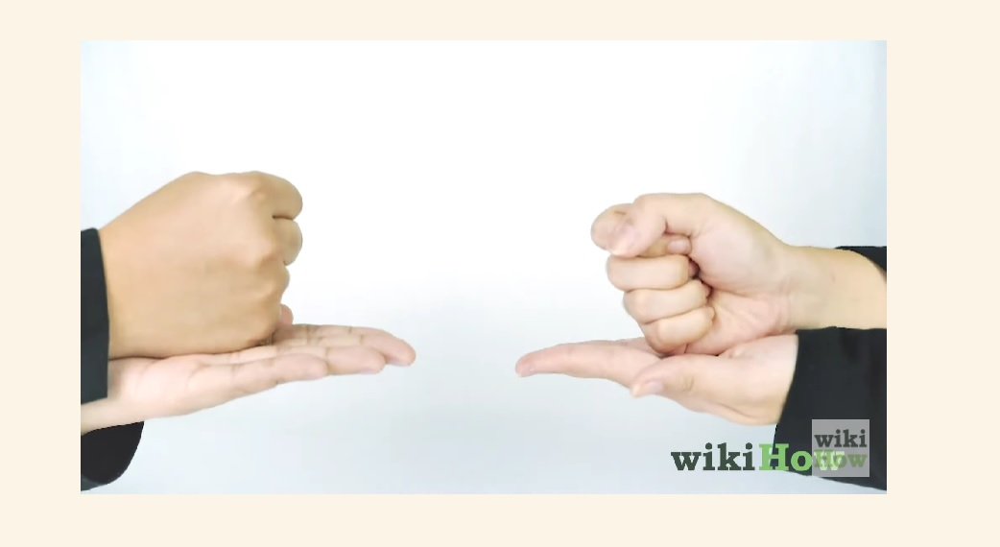
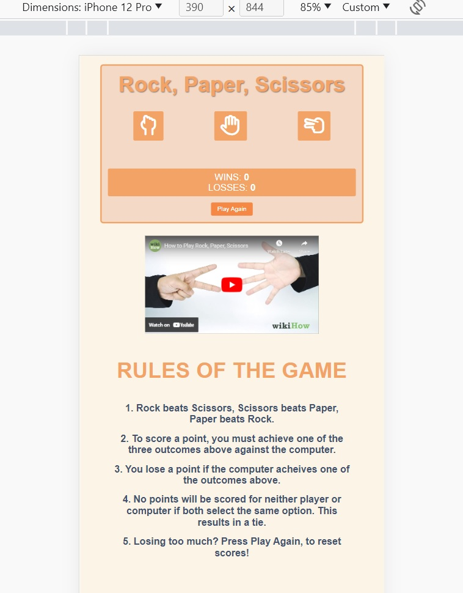
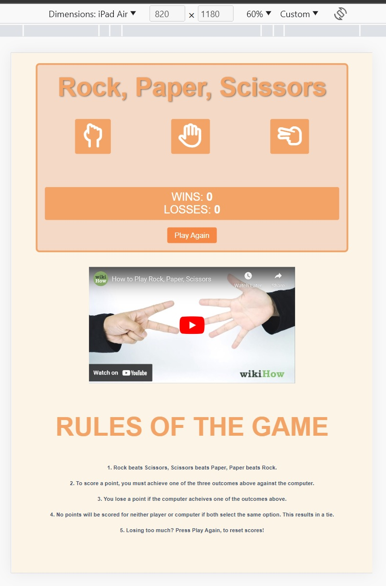
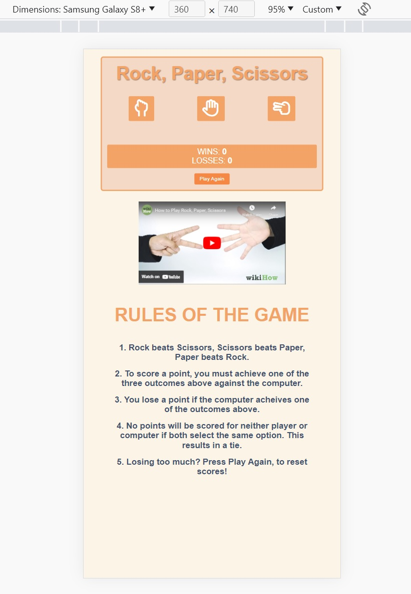

<h1 align="center">Rock-Paper-Scissors</h1>

[View the live project here.](https://masd91.github.io/Rock-Paper-Scissors/)

Project Goal

The goal of this project is to create a responsive and user-friendly JavaScript game website for Rock-Paper-Scissors. The website will have a simple and intuitive design, ensuring a seamless and enjoyable experience for users on all viewports. Clear instructions and rules will be provided, allowing both first-time visitors and returning users to easily understand and play the game. The website will be regularly updated with new features to keep frequent users engaged and provide an element of novelty. Overall, the project aims to create a fun and accessible platform for players to compete in the classic game of Rock-Paper-Scissors


## User Experience (UX)

-   ### User stories

    -   #### First Time Visitor Goals

        1. As a First Time Visitor, I want to easily understand the main purpose of the site and play the game.
        2. As a First Time Visitor, I want to be able to easily navigate throughout the site to find content.
       

    -   #### Returning Visitor Goals

        1. As a Returning Visitor, I want to quickly jump back into the same game I had previously played without other info first.
       

    -   #### Frequent User Goals
        1. As a Frequent User, I want to check to see if there are any newly added features to the game.
-   ### Design
    -   #### Colour Scheme
        -   I have chosen a peach pink and orange color scheme for the website to create a fun and engaging atmosphere. The warm and vibrant colors aim to enhance the user experience and make the game more visually appealing. 
    -   #### Typography
        -   In terms of typography, I have used the Arial font as it is widely recognized and ensures easy readability across different devices. Additionally, I have incorporated Font Awesome icons to add visual interest and improve usability. These icons represent the rock, paper, and scissors options, making it easier for users to select their choices in the game. Overall, the styling and colors aim to create an enjoyable and visually pleasing experience for players.
    -   #### Imagery
        -   No imagery was used.


## Features

-   Responsive on all device sizes

-   Interactive game

## Technologies Used

### Languages Used

-   [HTML5](https://en.wikipedia.org/wiki/HTML5)
-   [CSS3](https://en.wikipedia.org/wiki/Cascading_Style_Sheets)
-   [JS](https://en.wikipedia.org/wiki/JavaScript)

### Frameworks, Libraries & Programs Used


1. [Font Awesome:](https://fontawesome.com/)
    - Font Awesome was used on all pages throughout the website to add icons for aesthetic and UX purposes.
1. [Git](https://git-scm.com/)
    - Git was used for version control by utilizing the Gitpod terminal to commit to Git and Push to GitHub.
1. [GitHub:](https://github.com/)
    - GitHub is used to store the projects code after being pushed from Git.


## Testing

The W3C Markup Validator and W3C CSS Validator Services were used to validate every page of the project to ensure there were no syntax errors in the project. I also used JSHINT to ensure all JS code was valid.

-   [W3C Markup Validator](assets/images/w3-html-validator.jpg)
-   [W3C CSS Validator](assets/images/w3-css-validator.jpg) 
-   [JSHINT Markup Validator](assets/images/jshint-validator.jpg)

### Testing User Stories from User Experience (UX) Section

-   #### First Time Visitor Goals

    1. As a First Time Visitor, I want to easily understand the main purpose of the site and to be able to play the game with no hassle.

        1. Upon entering the site, users are automatically greeted to the game and the set of rules and instructions on the same page.


        2. The main point is clear to see that it is a game.
        3. The user has 4 options, 3 of which are part of the game and the 4th is to restart the game which are circled in the pictured below and also  shots of each button being tested.

These are all the buttons that are selectable. 


Once the Rock button is selected then the code runs to give you an outcome and in this case it is a tie so no score is incremented.


In this turn, we have selected paper and the computer has beat us and you will see the code has been incremented to a loss.


In the final option, we have beat the computer with scissors and you will see a point for us have been incremented.


If you are fed up of losing and embarrassed by your score, or, someone else wants to play, then you can select the Play Again button to wipe the slate clean and start again. 


        4. There is also a youtube video now embeded which is also shown to be working.




    2. As a First Time Visitor, I want to be able to easily be able to navigate throughout the site to find content and the instructions.

        1. The site has been designed to be played and viewed all on one page as pictured below.


        2.

-   #### Returning Visitor Goals

    1. As a Returning Visitor, I want to find the same simple content with easy access.

        1. This is clear as there is only one page to navigate through.


-   #### Frequent User Goals

    1. As a Frequent User, I want to check to see if there are any newly added features to the game.

        1. The user would already be comfortable with the page layout so new features would be easy to spot..


### Further Testing

-   The Website was tested on Google Chrome, Internet Explorer, Microsoft Edge and Safari browsers.
-   The website was viewed on a variety of devices such as PC, Laptop, Smartphones and Tablets.





-   Friends and family members were asked to review the site and documentation to point out any bugs and/or user experience issues.

### Known Bugs

- No known bugs.

## Deployment

### GitHub Pages

The project was deployed to GitHub Pages using the following steps...

1. Log in to GitHub and locate the [GitHub Repository](https://github.com/)
2. At the top of the Repository (not top of page), locate the "Settings" Button on the menu.
    - Alternatively Click [Here](https://raw.githubusercontent.com/) for a GIF demonstrating the process starting from Step 2.
3. Scroll down the Settings page until you locate the "GitHub Pages" Section.
4. Under "Source", click the dropdown called "None" and select "Master Branch".
5. The page will automatically refresh.
6. Scroll back down through the page to locate the now published site [link](https://github.com/MasD91/Rock-Paper-Scissors) in the "GitHub Pages" section.

### Forking the GitHub Repository

By forking the GitHub Repository we make a copy of the original repository on our GitHub account to view and/or make changes without affecting the original repository by using the following steps...

1. Log in to GitHub and locate the [GitHub Repository](https://github.com/MasD91/Rock-Paper-Scissors)
2. At the top of the Repository (not top of page) just above the "Settings" Button on the menu, locate the "Fork" Button.
3. You should now have a copy of the original repository in your GitHub account.

### Making a Local Clone

1. Log in to GitHub and locate the [GitHub Repository](https://github.com/MasD91/Rock-Paper-Scissors)
2. Under the repository name, click "Clone or download".
3. To clone the repository using HTTPS, under "Clone with HTTPS", copy the link.
4. Open Git Bash
5. Change the current working directory to the location where you want the cloned directory to be made.
6. Type `git clone`, and then paste the URL you copied in Step 3.

```
$ git clone https://github.com/MasD91/Rock-Paper-Scissors
```

7. Press Enter. Your local clone will be created.

```
$ git clone https://github.com/MasD91/Rock-Paper-Scissors
> Cloning into `CI-Clone`...
> remote: Counting objects: 10, done.
> remote: Compressing objects: 100% (8/8), done.
> remove: Total 10 (delta 1), reused 10 (delta 1)
> Unpacking objects: 100% (10/10), done.
```
## Credits

### Code

-   The hand shapes were created using Font Awesome. (https://fontawesome.com/)

### Content

-   Most of the content was written by, myself, the developer.
-   A dev friend Ainsley Chang helped me with many issues including sizing for viewports, js code for reset button and js code for update score. 


### Acknowledgements

-   My Mentor Dario for helping me with some finishing touches.
